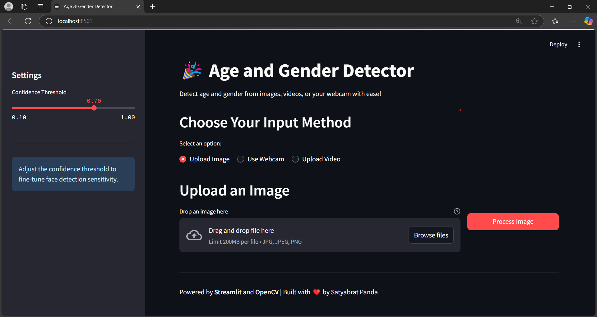
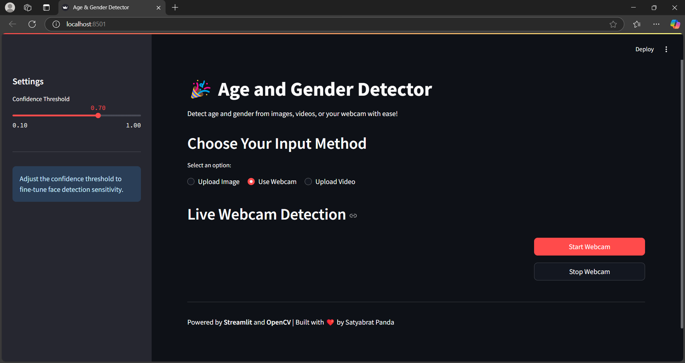

# 🧐 Age & Gender Detection App 🚀  
A Smart Streamlit App for Predicting Age and Gender from Faces in Real-Time

Welcome to the **Age & Gender Detection App**! This project uses **deep learning** and **computer vision** to detect faces in images, video, or webcam feeds and predict their **age range** and **gender** using pre-trained neural networks — all packed into a sleek and interactive **Streamlit** web interface.

---

## 📸 Demo Preview

> 🔍 Upload an image, turn on your webcam, or drop a video file — and let the model do the rest!



---

## ✨ Features

✅ Real-time face detection with bounding boxes  
✅ Accurate **gender** and **age range** predictions  
✅ Upload **images**, **videos**, or use your **webcam**  
✅ Dynamic labeling with smart text placement  
✅ Easy-to-use Streamlit interface  
✅ Adjustable confidence threshold  

---

## 🛠 Tech Stack

- **Python 3.7+**
- [**Streamlit**](https://streamlit.io/) — For the web interface  
- **OpenCV DNN** — For face detection  
- **Caffe Models** — For age and gender classification  
- **NumPy** — For array manipulation  

---

## 📁 Folder Structure

```
Gender-and-Age-Detection/
├── dataset images/                  # (Optional) Folder for sample images
├── age_deploy.prototxt             # Age model structure (Caffe)
├── age_net.caffemodel              # Age model weights
├── gender_deploy.prototxt          # Gender model structure (Caffe)
├── gender_net.caffemodel           # Gender model weights
├── opencv_face_detector.pbtxt      # Face detector config
├── opencv_face_detector_uint8.pb   # Face detector weights
├── main.py                         # The main Streamlit app
└── README.md                       # Project documentation (this file)
```

---

## 🛆 Installation

Clone the repository and install dependencies:

```bash
git clone https://github.com/yourusername/Gender-and-Age-Detection.git
cd Gender-and-Age-Detection

# Recommended to use a virtual environment
pip install -r requirements.txt
```

If `requirements.txt` is not provided, manually install:

```bash
pip install streamlit opencv-python-headless numpy
```

> Use `opencv-python` instead of `opencv-python-headless` if you're not running in a headless environment.

---

## ▶️ How to Run the App

```bash
streamlit run main.py
```

Once launched, your default browser will open with the app running at `http://localhost:8501`.

---

## 🧠 How It Works

1. **Face Detection**  
   Uses a pre-trained OpenCV DNN face detector (`.pb` and `.pbtxt`) to locate faces in the input.

2. **Age & Gender Prediction**  
   Cropped face regions are passed through:
   - `age_net.caffemodel` → Predicts age group like `(8-12)`, `(20-28)`, etc.
   - `gender_net.caffemodel` → Predicts either `Male` or `Female`.

3. **Overlay Results**  
   Predictions are drawn with dynamic text size based on face box height for visibility and aesthetic placement.

---

## 👤 Author

**Satyabrat Panda**  
📧 *[your.email@example.com]*  
🔗 [LinkedIn](https://www.linkedin.com/in/satyabrat-panda-2538b62b8/) | [GitHub](https://github.com/satyabrat-panda)

---

## 📄 License

This project is licensed under the **MIT License** — feel free to use, share, and modify!

